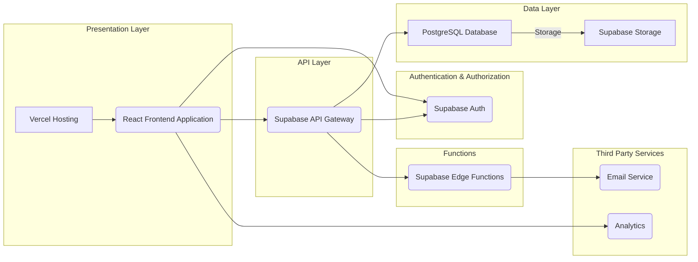
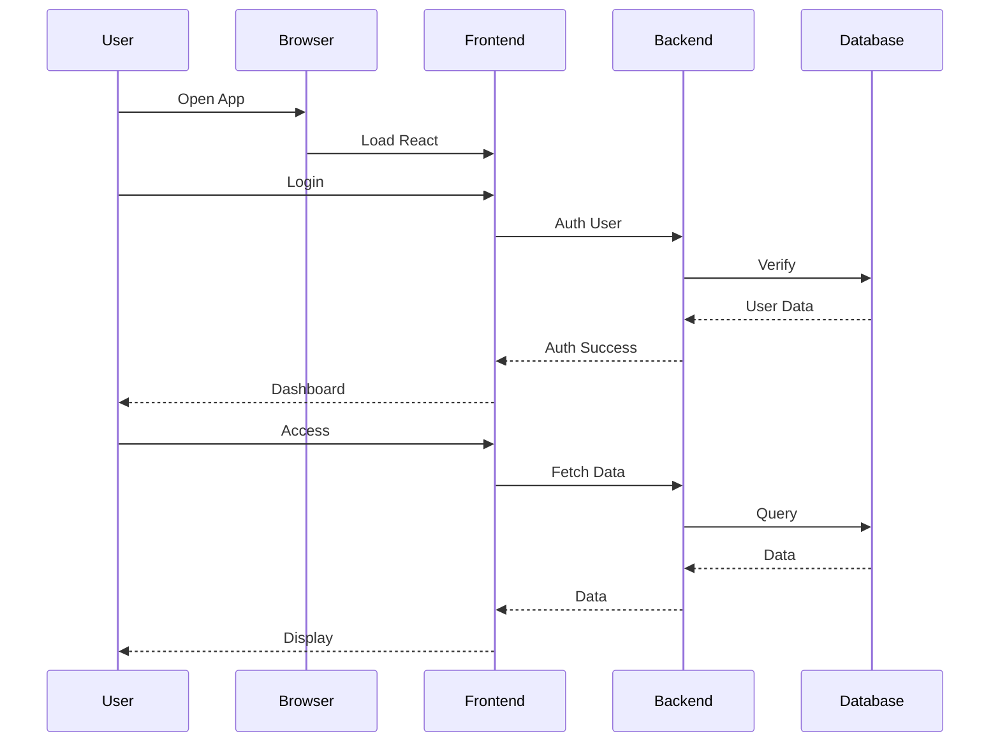
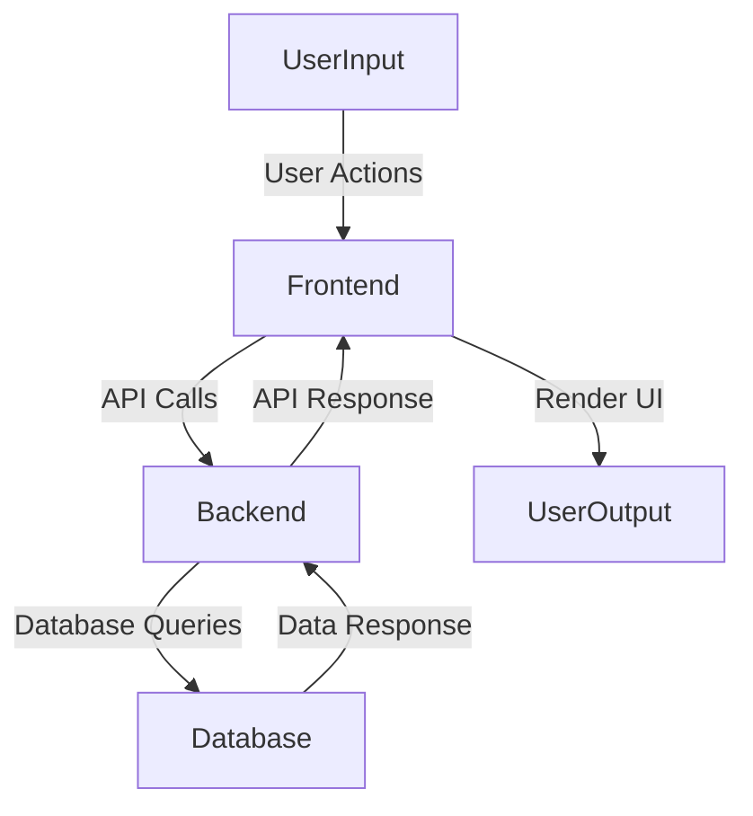
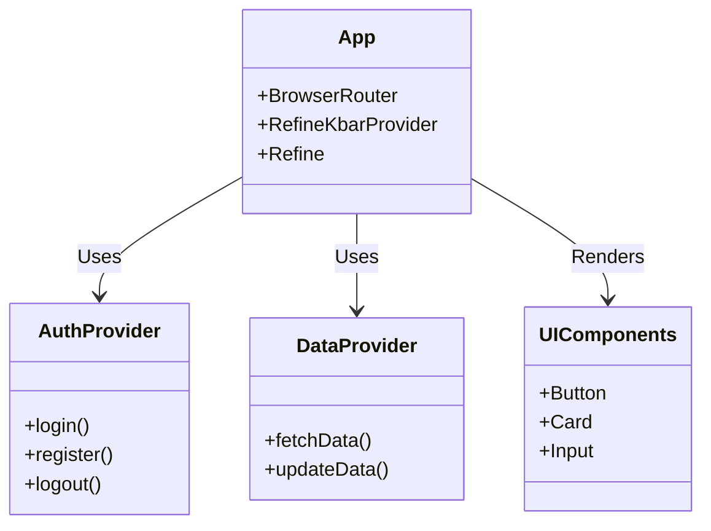
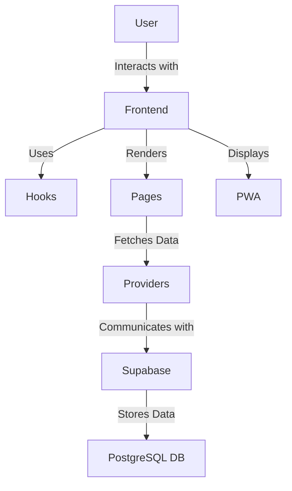
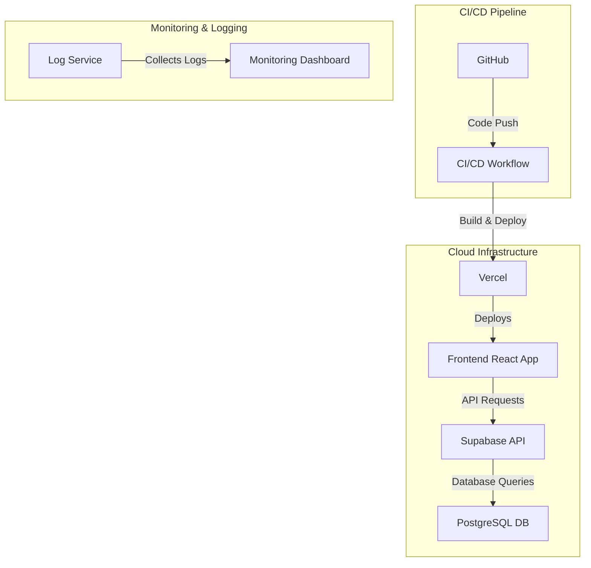
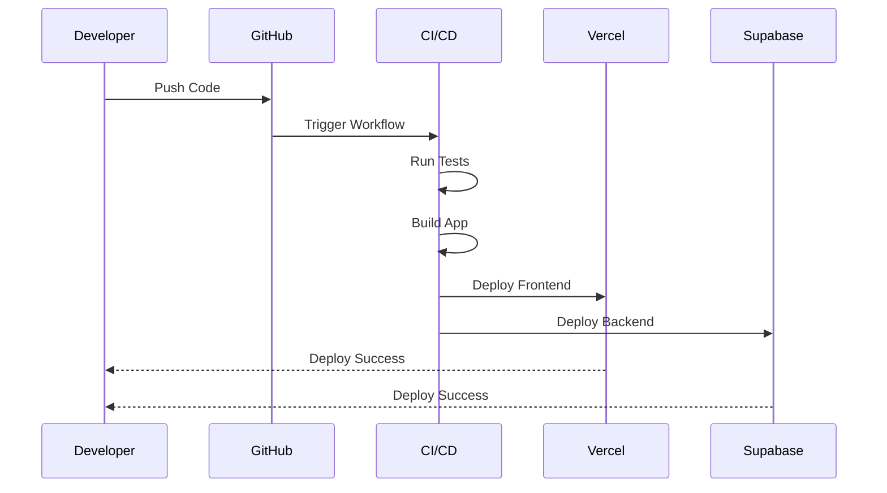
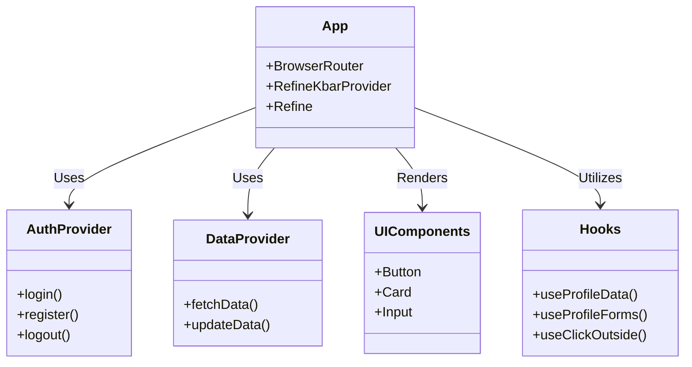

# JHCSC Alumni Portal

**Mobile View**

**Login Page**

**Register Page**

**Home Page**

## Technical Documentation: Project Architecture

### 1. Project Overview

Full-stack web application for alumni management, hosted on Vercel, using Supabase as a backend service.

### 2. Technology Stack

| Category          | Technology    | Description                                                                 |
| :---------------- | :------------ | :-------------------------------------------------------------------------- |
| **Frontend**      | React         | Dynamic UI library.                                                        |
|                   | Ant Design    | UI component library.                                                      |
|                   | TypeScript    | Statically typed JavaScript.                                                |
| **Backend**       | Supabase      | BaaS: PostgreSQL, auth, real-time, storage.                                |
|                   | PostgreSQL    | Relational database.                                                        |
| **Hosting**       | Vercel        | Cloud hosting for frontend.                                                 |
| **Infrastructure**| Vercel/Supabase| Hosting and backend service management.                                    |
| **Other**         | Git           | Version control.                                                            |

### 3. System Architecture

### 4. User Interaction Flow

### 5. Data Flow Diagram

### 6. Component Diagram

```mermaid
classDiagram
    direction BT
class alumni {
   text profile_picture
   varchar(100) first_name
   varchar(100) middle_name
   varchar(100) last_name
   date birth_date
   integer year_batch
   integer year_graduation
   varchar(150) profile_description
   varchar(255) location
   timestamp with time zone created_at
   timestamp with time zone updated_at
   bigint degree_id
   uuid id
}
class announcements {
   varchar(255) title
   text description
   timestamp with time zone posted_date
   timestamp with time zone created_at
   timestamp with time zone updated_at
   integer id
}
class contact_socials {
   uuid alumni_user_id
   varchar(100) platform_name
   text link
   timestamp with time zone created_at
   timestamp with time zone updated_at
   integer id
}
class contributors {
   integer fundraising_project_id
   uuid alumni_user_id
   varchar(50) donation_type
   numeric(12,2) amount
   text goods_description
   text proof_url
   timestamp with time zone created_at
   timestamp with time zone updated_at
   integer id
}
class degree_categories {
   text category_name
   bigint id
}
class degrees {
   text degree_name
   bigint degree_category_id
   bigint id
}
class departments {
   varchar(255) name
   timestamp with time zone created_at
   timestamp with time zone updated_at
   integer id
}
class employment_history {
   uuid alumni_user_id
   varchar(255) company_name
   date start_date
   date end_date
   timestamp with time zone created_at
   timestamp with time zone updated_at
   integer id
}
class event_links {
   integer event_id
   text link
   timestamp with time zone created_at
   timestamp with time zone updated_at
   integer id
}
class events {
   varchar(255) title
   text description
   timestamp with time zone event_datetime
   varchar(255) location
   timestamp with time zone created_at
   timestamp with time zone updated_at
   double precision goal
   timestamp with time zone deadline
   boolean is_fundraising
   integer id
}
class programs {
   varchar(255) name
   integer department_id
   timestamp with time zone created_at
   timestamp with time zone updated_at
   integer id
}
class sy_officers {
   integer department_id
   uuid alumni_user_id
   varchar(100) role
   date start_date
   date end_date
   timestamp with time zone created_at
   timestamp with time zone updated_at
   integer id
}
class user_roles {
   uuid user_id
   system_roles role
}
class users {
   text email
   boolean is_active
   timestamp with time zone created_at
   timestamp with time zone updated_at
   timestamp with time zone last_login
   uuid id
}
class vw_alumni_directory {
   uuid id
   text profile_picture
   varchar(100) first_name
   varchar(100) middle_name
   varchar(100) last_name
   date birth_date
   integer year_batch
   integer year_graduation
   varchar(150) profile_description
   varchar(255) location
   timestamp with time zone created_at
   timestamp with time zone updated_at
   bigint degree_id
   text degree_name
   bigint degree_category_id
   text degree_category
}
class vw_announcements {
   integer id
   varchar(255) title
   text description
   timestamp with time zone posted_date
   timestamp with time zone created_at
   timestamp with time zone updated_at
}
class vw_degree_programs {
   bigint id
   text degree_name
   bigint degree_category_id
   text degree_category
}
class vw_departments {
   integer id
   varchar(255) name
   timestamp with time zone created_at
   timestamp with time zone updated_at
}
class vw_events {
   integer id
   varchar(255) title
   text description
   timestamp with time zone event_datetime
   varchar(255) location
   timestamp with time zone created_at
   timestamp with time zone updated_at
   boolean is_fundraising
}
class vw_fundraising_campaigns {
   integer id
   varchar(255) title
   text description
   timestamp with time zone event_datetime
   varchar(255) location
   timestamp with time zone created_at
   timestamp with time zone updated_at
   double precision goal
   timestamp with time zone deadline
   numeric current_amount
   bigint donor_count
}
class vw_fundraising_contributions {
   integer contribution_id
   integer fundraising_project_id
   uuid alumni_user_id
   varchar(50) donation_type
   numeric(12,2) amount
   text goods_description
   text proof_url
   timestamp with time zone created_at
   timestamp with time zone updated_at
   varchar(100) first_name
   varchar(100) last_name
}
class vw_fundraising_projects {
   integer id
   varchar(255) title
   text description
   timestamp with time zone event_datetime
   varchar(255) location
   timestamp with time zone created_at
   timestamp with time zone updated_at
   double precision goal
   timestamp with time zone deadline
}
class vw_officers {
   integer id
   integer department_id
   varchar(255) department_name
   uuid alumni_user_id
   varchar(100) first_name
   varchar(100) last_name
   varchar(100) role
   date start_date
   date end_date
   timestamp with time zone created_at
   timestamp with time zone updated_at
}
class vw_user_profile {
   uuid id
   text profile_picture
   varchar(100) first_name
   varchar(100) middle_name
   varchar(100) last_name
   date birth_date
   integer year_batch
   integer year_graduation
   varchar(150) profile_description
   varchar(255) location
   timestamp with time zone created_at
   timestamp with time zone updated_at
   bigint degree_id
   text degree_name
   bigint degree_category_id
   text degree_category
   json employment_history
   json contact_socials
   json roles
   json officers
   json contributions
}

alumni  -->  degrees : uses
alumni  -->  users : has
contact_socials  -->  alumni : belongs to
contributors  -->  alumni : from
degrees  -->  degree_categories : is of
employment_history  -->  alumni : belongs to
event_links  -->  events : links to
programs  -->  departments : part of
sy_officers  -->  alumni : is officer
sy_officers  -->  departments : for
user_roles  -->  users : has role
vw_alumni_directory  -->  degree_categories : from
vw_alumni_directory  -->  degrees : from
vw_degree_programs  -->  degree_categories : from
vw_officers  -->  departments : from
vw_user_profile  -->  degree_categories : from
vw_user_profile  -->  degrees : from
```

### 8. Database Details

| Table Name          | Description                                                                                               |
| :------------------ | :-------------------------------------------------------------------------------------------------------- |
| `announcements`     | Platform announcements.                                                                                   |
| `degree_categories` | Categories of degrees.                                                                                    |
| `degrees`           | Degrees linked to categories.                                                                             |
| `departments`       | University departments.                                                                                   |
| `events`            | Events, including fundraisers.                                                                            |
| `event_links`       | Links related to events.                                                                                  |
| `programs`          | Programs under departments.                                                                               |
| `users`             | Application users (Supabase auth).                                                                        |
| `alumni`            | Alumni profile details.                                                                                   |
| `contact_socials`   | Alumni social media links.                                                                                |
| `contributors`      | Alumni contributions to fundraising.                                                                      |
| `employment_history`| Alumni work experience.                                                                                   |
| `sy_officers`       | Student officers per department.                                                                          |
| `user_roles`        | User roles.                                                                                               |

### 9. API Endpoints

*   Supabase-generated RESTful APIs for all tables.
*   Authentication handled by Supabase auth APIs.

### 10. Key Technicals

*   **Security:** RLS enforced.
*   **Real-time:** Supabase real-time for live updates.
*   **Scalability:** Vercel and Supabase handle growth.
*   **Modularity:** Independent updates.

### 11. Database Views

| View Name               | Description                                                                 |
| :---------------------- | :-------------------------------------------------------------------------- |
| `vw_alumni_directory` | Simplified alumni info.                            |
| `vw_announcements`      | Simplified announcements.                                |
| `vw_degree_programs`    | Combined degrees and categories.                               |
| `vw_departments`       | Departments table.                                 |
| `vw_events`             | Simplified events.                               |
| `vw_fundraising_campaigns` | Fundraising events.                  |
| `vw_fundraising_contributions`| Fundraising contributions.             |
| `vw_fundraising_projects`   | Simplified fundraising projects.                                 |
| `vw_officers` | Combined officers, departments, and alumni.                                       |
|`vw_user_profile`| User info, including alumni and relations.                     |

### 12. Database Functions

| Function Name                      | Description                                                                                                   |
| :--------------------------------- | :------------------------------------------------------------------------------------------------------------ |
| `assign_default_role`             | Assigns 'ALUMNI' role to new users.                                |
| `has_role`                        | Validates user role.                                            |
| `is_admin`                        | Checks for 'ADMIN' role.                                                          |
| `login_user`                   | Verifies user is not deleted.                                             |
| `prevent_login_if_deleted` | Prevents deleted users from logging in.                             |
| `register_entity`                 | Registers user entity.                                |
|`sync_deleted_at_with_is_active`| Syncs `is_active` and `deleted_at`.|
| `sync_user_metadata` | Syncs alumni metadata with `auth.users`. |
| `update_alumni_profile_picture`    | Updates alumni profile picture.                                                                  |
| `update_auth_email` | Updates email on `auth.users` table.                                  |
| `update_email_in_related_tables` | Syncs email updates across tables.                        |
| `update_updated_at_column`    | Updates `updated_at` timestamp.         |

### 13. Features

*   Alumni Directory
*   Announcements
*   Events
*   Fundraising
*   User Profiles
*   Role-Based Access
*   Real-Time Updates
*   Responsive Design
*   Authentication
*   Data Sync

### 14. Hooks

*   `useProfileData`, `useProfileForms`, `useClickOutside`.

### 15. Pages

*   Home, Alumni Directory, Announcements, Events, Fundraising, Profile.

### 16. Providers

*   Data Provider, Live Provider (Supabase).

### 17. PWA

*   Offline capabilities, PWA prompt.

### 18. Feature Interaction Diagram

### 19. How It Works

*   **Features**: Frontend uses hooks to fetch data via providers, interacting with Supabase.
*   **Hooks**: Manage state and side effects, using providers to get data.
*   **Pages**: Use hooks to fetch data and render components.
*   **Providers**: Handle CRUD operations and real-time updates with Supabase.
*   **PWA**: Provides offline capabilities and prompts for updates.

### 20. Infrastructure Diagram

### 21. Deployment Pipeline

### 22. Component Interaction

### 23. How It Works

*   **Infrastructure**: Vercel for frontend, Supabase for backend, CI/CD for automation.
*   **Deployment**: Code pushed to GitHub, CI/CD builds and deploys to Vercel and Supabase.

### 24. Dependencies and Frameworks

#### Core Frameworks

*   **`react`**: The core library for building user interfaces.
*   **`react-dom`**: Provides DOM-specific methods for React.
*   **`react-router-dom`**: Enables routing and navigation within the application.
*   **`typescript`**: Adds static typing to JavaScript, improving code maintainability.
*   **`vite`**: A fast build tool and development server.
*   **`@refinedev/core`**: Core functionalities for Refine framework.
*   **`@refinedev/cli`**: Command-line interface for Refine.
*   **`@refinedev/react-router-v6`**: Router integration for Refine.
*   **`@refinedev/supabase`**: Supabase data provider for Refine.

#### UI Libraries and Styling

*   **`antd`**: Ant Design UI component library.
*   **`@ant-design/icons`**: Ant Design icon library.
*   **`@phosphor-icons/react`**: Another icon library.

#### Data Handling

*   **`lodash`**: Utility library for JavaScript.
*   **`@types/lodash`**: TypeScript type definitions for Lodash.
*   **`dayjs`**: Date manipulation library.
*   **`moment`**: Another date manipulation library.

#### Content and Markdown

*   **`@uiw/react-md-editor`**: Markdown editor component.

#### Other Utilities

*   **`usehooks-ts`**: Collection of useful React hooks.

#### Development Tools

*   **`@biomejs/biome`**: Code formatter and linter.
*   **`@types/*`**: TypeScript type definitions.
*   **`@vitejs/plugin-react`**: Vite plugin for React.
*   **`eslint`**: JavaScript linter.
*   **`eslint-plugin-react-hooks`**: ESLint plugin for React hooks.
*   **`eslint-plugin-react-refresh`**: ESLint plugin for React refresh.
*   **`@refinedev/devtools`**: Refine Devtools.
*   **`@refinedev/inferencer`**: Refine Inferencer.
*   **`@refinedev/kbar`**: Refine Kbar component.

### 25. Table Relationships

*   **`users`**
    *   **One-to-many** with `user_roles` (one user can have multiple roles).
    *   **One-to-one** with `alumni` (one user can have one alumni profile).
*   **`user_roles`**
    *   **Many-to-one** with `users` (many roles belong to one user).
    *   **Many-to-one** with `system_roles` (many roles belong to one system role).
*   **`system_roles`**
    *   **One-to-many** with `user_roles` (one system role can be assigned to multiple users).
*   **`alumni`**
    *   **One-to-one** with `users` (one alumni profile belongs to one user).
    *   **Many-to-one** with `degrees` (many alumni can have one degree).
    *   **One-to-many** with `contact_socials` (one alumni can have multiple social links).
    *   **One-to-many** with `employment_history` (one alumni can have multiple employment records).
    *   **One-to-many** with `sy_officers` (one alumni can have multiple officer records).
    *   **One-to-many** with `contributors` (one alumni can have multiple contributions).
*   **`degrees`**
    *   **Many-to-one** with `degree_categories` (many degrees belong to one category).
    *   **One-to-many** with `alumni` (one degree can be associated with multiple alumni).
*   **`degree_categories`**
    *   **One-to-many** with `degrees` (one category can have multiple degrees).
*   **`contact_socials`**
    *   **Many-to-one** with `alumni` (many social links belong to one alumni).
*   **`employment_history`**
    *   **Many-to-one** with `alumni` (many employment records belong to one alumni).
*   **`sy_officers`**
    *   **Many-to-one** with `alumni` (many officer records belong to one alumni).
    *   **Many-to-one** with `departments` (many officers belong to one department).
*   **`departments`**
    *   **One-to-many** with `sy_officers` (one department can have multiple officers).
    *   **One-to-many** with `programs` (one department can have multiple programs).
*   **`programs`**
    *   **Many-to-one** with `departments` (many programs belong to one department).
*   **`events`**
    *   **One-to-many** with `event_links` (one event can have multiple links).
    *   **One-to-many** with `contributors` (one event can have multiple contributions).
*   **`event_links`**
    *   **Many-to-one** with `events` (many links belong to one event).
*   **`contributors`**
    *   **Many-to-one** with `events` (many contributions belong to one event).
    *   **Many-to-one** with `alumni` (many contributions belong to one alumni).
*   **`announcements`**
    *   No direct relationships with other tables (standalone table).

### 26. Admin Frontend with Refine.dev

The admin frontend uses **Refine.dev** with the following packages:

*   **@refinedev/supabase** - Data provider for Supabase backend
*   **@refinedev/antd** - Ant Design UI components
*   **@refinedev/react-router-v6** - Routing
*   **@refinedev/inferencer** - API Inferencer UI components
*   **@refinedev/kbar** - Command palette
