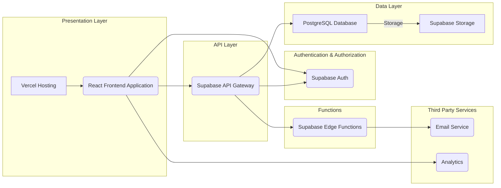
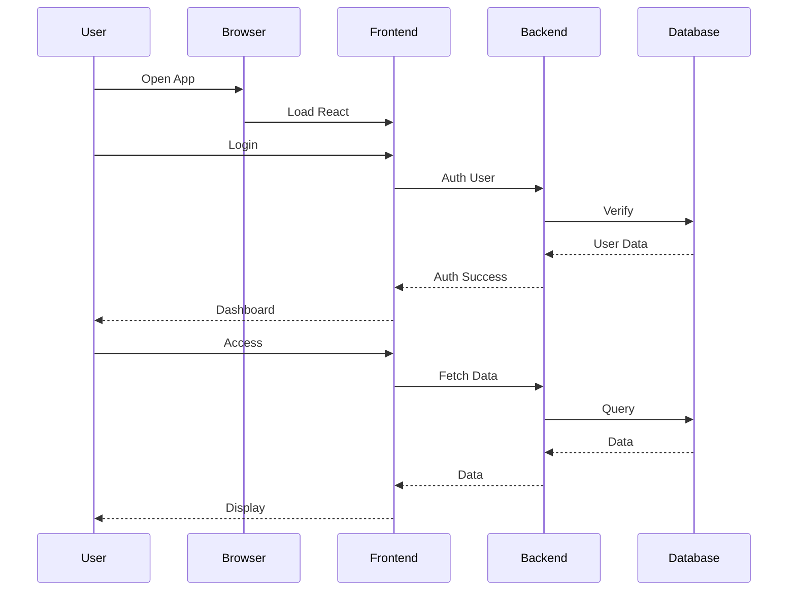
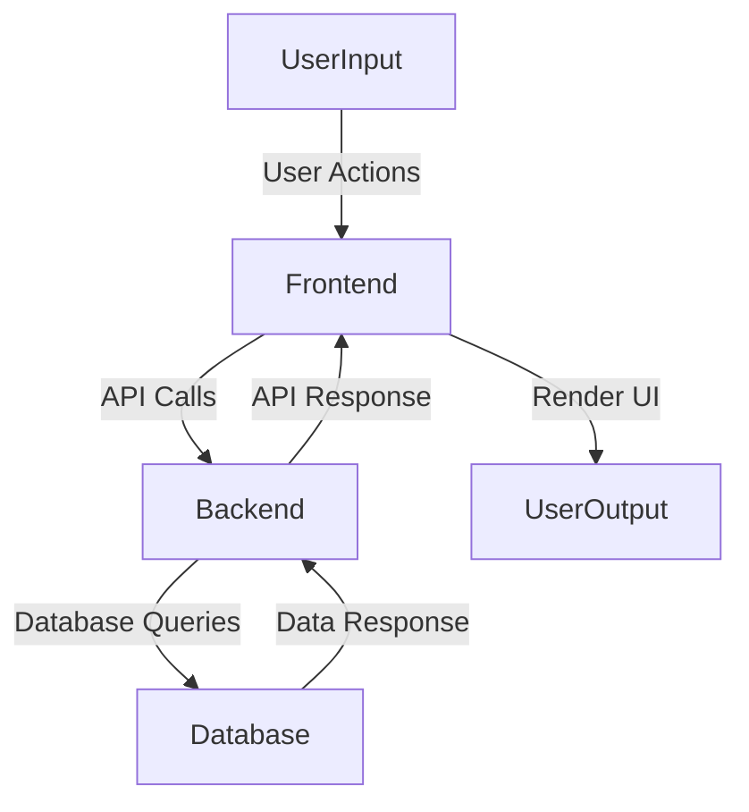
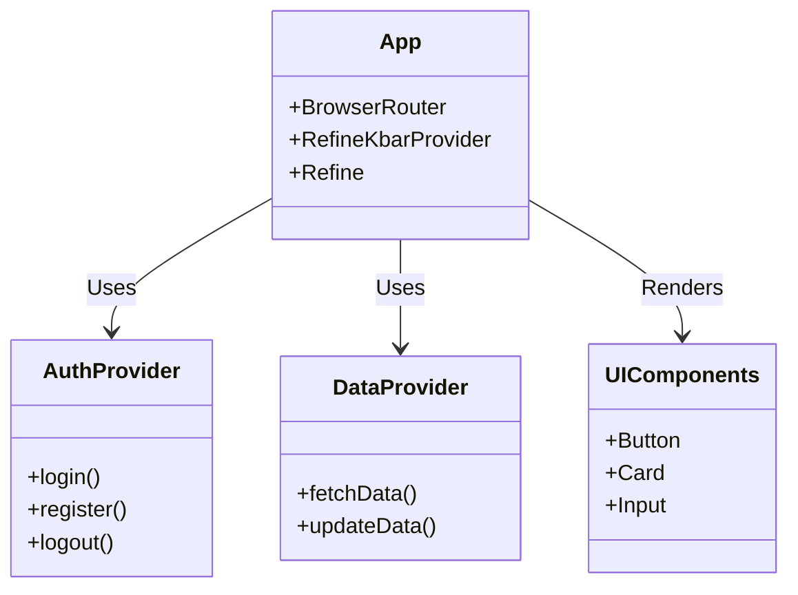
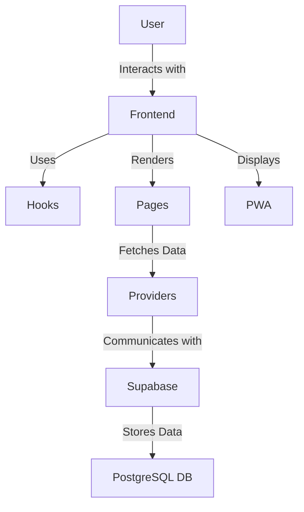
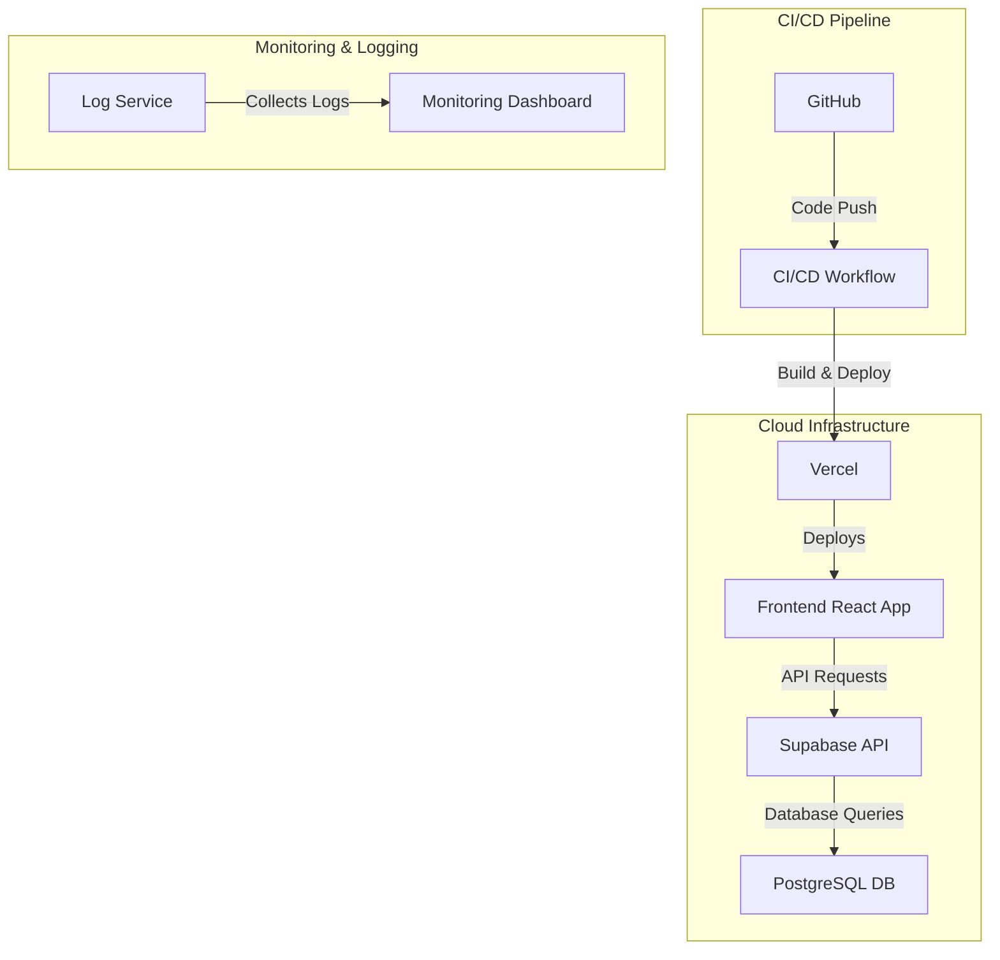
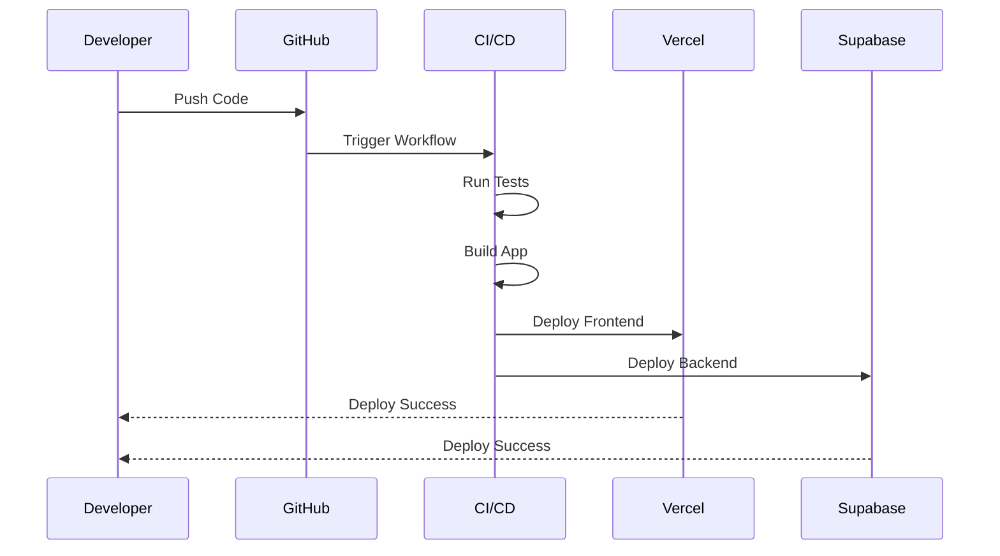
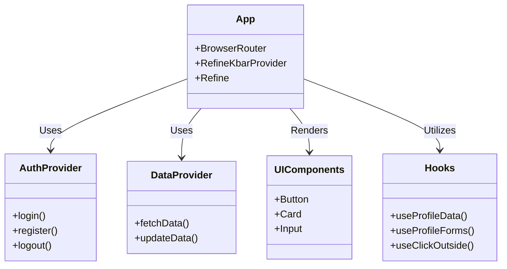

# JHCSC Alumni Portal


**Mobile View**


**Login Page**


**Register Page**


**Home Page**


## Technical Documentation: Project Architecture

### 1. Project Overview

Full-stack web application for alumni management, hosted on Vercel, using Supabase as a backend service.

### 2. Technology Stack

| Category          | Technology    | Description                                                                 |
| :---------------- | :------------ | :-------------------------------------------------------------------------- |
| **Frontend**      | React         | Dynamic UI library.                                                        |
|                   | Ant Design    | UI component library.                                                      |
|                   | TypeScript    | Statically typed JavaScript.                                                |
| **Backend**       | Supabase      | BaaS: PostgreSQL, auth, real-time, storage.                                |
|                   | PostgreSQL    | Relational database.                                                        |
| **Hosting**       | Vercel        | Cloud hosting for frontend.                                                 |
| **Infrastructure**| Vercel/Supabase| Hosting and backend service management.                                    |
| **Other**         | Git           | Version control.                                                            |

### 3. System Architecture




### 4. User Interaction Flow



### 5. Data Flow Diagram



### 6. Component Diagram

```mermaid
classDiagram
    direction BT
class alumni {
   text profile_picture
   varchar(100) first_name
   varchar(100) middle_name
   varchar(100) last_name
   date birth_date
   integer year_batch
   integer year_graduation
   varchar(150) profile_description
   varchar(255) location
   timestamp with time zone created_at
   timestamp with time zone updated_at
   bigint degree_id
   uuid id
}
class announcements {
   varchar(255) title
   text description
   timestamp with time zone posted_date
   timestamp with time zone created_at
   timestamp with time zone updated_at
   integer id
}
class contact_socials {
   uuid alumni_user_id
   varchar(100) platform_name
   text link
   timestamp with time zone created_at
   timestamp with time zone updated_at
   integer id
}
class contributors {
   integer fundraising_project_id
   uuid alumni_user_id
   varchar(50) donation_type
   numeric(12,2) amount
   text goods_description
   text proof_url
   timestamp with time zone created_at
   timestamp with time zone updated_at
   integer id
}
class degree_categories {
   text category_name
   bigint id
}
class degrees {
   text degree_name
   bigint degree_category_id
   bigint id
}
class departments {
   varchar(255) name
   timestamp with time zone created_at
   timestamp with time zone updated_at
   integer id
}
class employment_history {
   uuid alumni_user_id
   varchar(255) company_name
   date start_date
   date end_date
   timestamp with time zone created_at
   timestamp with time zone updated_at
   integer id
}
class event_links {
   integer event_id
   text link
   timestamp with time zone created_at
   timestamp with time zone updated_at
   integer id
}
class events {
   varchar(255) title
   text description
   timestamp with time zone event_datetime
   varchar(255) location
   timestamp with time zone created_at
   timestamp with time zone updated_at
   double precision goal
   timestamp with time zone deadline
   boolean is_fundraising
   integer id
}
class programs {
   varchar(255) name
   integer department_id
   timestamp with time zone created_at
   timestamp with time zone updated_at
   integer id
}
class sy_officers {
   integer department_id
   uuid alumni_user_id
   varchar(100) role
   date start_date
   date end_date
   timestamp with time zone created_at
   timestamp with time zone updated_at
   integer id
}
class user_roles {
   uuid user_id
   system_roles role
}
class users {
   text email
   boolean is_active
   timestamp with time zone created_at
   timestamp with time zone updated_at
   timestamp with time zone last_login
   uuid id
}
class vw_alumni_directory {
   uuid id
   text profile_picture
   varchar(100) first_name
   varchar(100) middle_name
   varchar(100) last_name
   date birth_date
   integer year_batch
   integer year_graduation
   varchar(150) profile_description
   varchar(255) location
   timestamp with time zone created_at
   timestamp with time zone updated_at
   bigint degree_id
   text degree_name
   bigint degree_category_id
   text degree_category
}
class vw_announcements {
   integer id
   varchar(255) title
   text description
   timestamp with time zone posted_date
   timestamp with time zone created_at
   timestamp with time zone updated_at
}
class vw_degree_programs {
   bigint id
   text degree_name
   bigint degree_category_id
   text degree_category
}
class vw_departments {
   integer id
   varchar(255) name
   timestamp with time zone created_at
   timestamp with time zone updated_at
}
class vw_events {
   integer id
   varchar(255) title
   text description
   timestamp with time zone event_datetime
   varchar(255) location
   timestamp with time zone created_at
   timestamp with time zone updated_at
   boolean is_fundraising
}
class vw_fundraising_campaigns {
   integer id
   varchar(255) title
   text description
   timestamp with time zone event_datetime
   varchar(255) location
   timestamp with time zone created_at
   timestamp with time zone updated_at
   double precision goal
   timestamp with time zone deadline
   numeric current_amount
   bigint donor_count
}
class vw_fundraising_contributions {
   integer contribution_id
   integer fundraising_project_id
   uuid alumni_user_id
   varchar(50) donation_type
   numeric(12,2) amount
   text goods_description
   text proof_url
   timestamp with time zone created_at
   timestamp with time zone updated_at
   varchar(100) first_name
   varchar(100) last_name
}
class vw_fundraising_projects {
   integer id
   varchar(255) title
   text description
   timestamp with time zone event_datetime
   varchar(255) location
   timestamp with time zone created_at
   timestamp with time zone updated_at
   double precision goal
   timestamp with time zone deadline
}
class vw_officers {
   integer id
   integer department_id
   varchar(255) department_name
   uuid alumni_user_id
   varchar(100) first_name
   varchar(100) last_name
   varchar(100) role
   date start_date
   date end_date
   timestamp with time zone created_at
   timestamp with time zone updated_at
}
class vw_user_profile {
   uuid id
   text profile_picture
   varchar(100) first_name
   varchar(100) middle_name
   varchar(100) last_name
   date birth_date
   integer year_batch
   integer year_graduation
   varchar(150) profile_description
   varchar(255) location
   timestamp with time zone created_at
   timestamp with time zone updated_at
   bigint degree_id
   text degree_name
   bigint degree_category_id
   text degree_category
   json employment_history
   json contact_socials
   json roles
   json officers
   json contributions
}

alumni  -->  degrees : uses
alumni  -->  users : has
contact_socials  -->  alumni : belongs to
contributors  -->  alumni : from
degrees  -->  degree_categories : is of
employment_history  -->  alumni : belongs to
event_links  -->  events : links to
programs  -->  departments : part of
sy_officers  -->  alumni : is officer
sy_officers  -->  departments : for
user_roles  -->  users : has role
vw_alumni_directory  -->  degree_categories : from
vw_alumni_directory  -->  degrees : from
vw_degree_programs  -->  degree_categories : from
vw_officers  -->  departments : from
vw_user_profile  -->  degree_categories : from
vw_user_profile  -->  degrees : from
```





### 8. Database Details

| Table Name          | Description                                                                                               |
| :------------------ | :-------------------------------------------------------------------------------------------------------- |
| `announcements`     | Platform announcements.                                                                                   |
| `degree_categories` | Categories of degrees.                                                                                    |
| `degrees`           | Degrees linked to categories.                                                                             |
| `departments`       | University departments.                                                                                   |
| `events`            | Events, including fundraisers.                                                                            |
| `event_links`       | Links related to events.                                                                                  |
| `programs`          | Programs under departments.                                                                               |
| `users`             | Application users (Supabase auth).                                                                        |
| `alumni`            | Alumni profile details.                                                                                   |
| `contact_socials`   | Alumni social media links.                                                                                |
| `contributors`      | Alumni contributions to fundraising.                                                                      |
| `employment_history`| Alumni work experience.                                                                                   |
| `sy_officers`       | Student officers per department.                                                                          |
| `user_roles`        | User roles.                                                                                               |

### 9. API Endpoints

*   Supabase-generated RESTful APIs for all tables.
*   Authentication handled by Supabase auth APIs.

### 10. Key Technicals

*   **Security:** RLS enforced.
*   **Real-time:** Supabase real-time for live updates.
*   **Scalability:** Vercel and Supabase handle growth.
*   **Modularity:** Independent updates.

### 11. Database Views

| View Name               | Description                                                                 |
| :---------------------- | :-------------------------------------------------------------------------- |
| `vw_alumni_directory` | Simplified alumni info.                            |
| `vw_announcements`      | Simplified announcements.                                |
| `vw_degree_programs`    | Combined degrees and categories.                               |
| `vw_departments`       | Departments table.                                 |
| `vw_events`             | Simplified events.                               |
| `vw_fundraising_campaigns` | Fundraising events.                  |
| `vw_fundraising_contributions`| Fundraising contributions.             |
| `vw_fundraising_projects`   | Simplified fundraising projects.                                 |
| `vw_officers` | Combined officers, departments, and alumni.                                       |
|`vw_user_profile`| User info, including alumni and relations.                     |

### 12. Database Functions

| Function Name                      | Description                                                                                                   |
| :--------------------------------- | :------------------------------------------------------------------------------------------------------------ |
| `assign_default_role`             | Assigns 'ALUMNI' role to new users.                                |
| `has_role`                        | Validates user role.                                            |
| `is_admin`                        | Checks for 'ADMIN' role.                                                          |
| `login_user`                   | Verifies user is not deleted.                                             |
| `prevent_login_if_deleted` | Prevents deleted users from logging in.                             |
| `register_entity`                 | Registers user entity.                                |
|`sync_deleted_at_with_is_active`| Syncs `is_active` and `deleted_at`.|
| `sync_user_metadata` | Syncs alumni metadata with `auth.users`. |
| `update_alumni_profile_picture`    | Updates alumni profile picture.                                                                  |
| `update_auth_email` | Updates email on `auth.users` table.                                  |
| `update_email_in_related_tables` | Syncs email updates across tables.                        |
| `update_updated_at_column`    | Updates `updated_at` timestamp.         |

### 13. Features

*   Alumni Directory
*   Announcements
*   Events
*   Fundraising
*   User Profiles
*   Role-Based Access
*   Real-Time Updates
*   Responsive Design
*   Authentication
*   Data Sync

### 14. Hooks

*   `useProfileData`, `useProfileForms`, `useClickOutside`.

### 15. Pages

*   Home, Alumni Directory, Announcements, Events, Fundraising, Profile.

### 16. Providers

*   Data Provider, Live Provider (Supabase).

### 17. PWA

*   Offline capabilities, PWA prompt.

### 18. Feature Interaction Diagram



### 19. How It Works

*   **Features**: Frontend uses hooks to fetch data via providers, interacting with Supabase.
*   **Hooks**: Manage state and side effects, using providers to get data.
*   **Pages**: Use hooks to fetch data and render components.
*   **Providers**: Handle CRUD operations and real-time updates with Supabase.
*   **PWA**: Provides offline capabilities and prompts for updates.

### 20. Infrastructure Diagram



### 21. Deployment Pipeline



### 22. Component Interaction



### 23. How It Works

*   **Infrastructure**: Vercel for frontend, Supabase for backend, CI/CD for automation.
*   **Deployment**: Code pushed to GitHub, CI/CD builds and deploys to Vercel and Supabase.

### 24. Dependencies and Frameworks

#### Core Frameworks

*   **`react`**: The core library for building user interfaces.
*   **`react-dom`**: Provides DOM-specific methods for React.
*   **`react-router-dom`**: Enables routing and navigation within the application.
*   **`typescript`**: Adds static typing to JavaScript, improving code maintainability.
*   **`vite`**: A fast build tool and development server.
*   **`@refinedev/core`**: Core functionalities for Refine framework.
*   **`@refinedev/cli`**: Command-line interface for Refine.
*   **`@refinedev/react-router-v6`**: Router integration for Refine.
*   **`@refinedev/supabase`**: Supabase data provider for Refine.

#### UI Libraries and Styling

*   **`antd`**: Ant Design UI component library.
*   **`@ant-design/icons`**: Ant Design icon library.
*   **`@phosphor-icons/react`**: Another icon library.

#### Data Handling

*   **`lodash`**: Utility library for JavaScript.
*   **`@types/lodash`**: TypeScript type definitions for Lodash.
*   **`dayjs`**: Date manipulation library.
*   **`moment`**: Another date manipulation library.

#### Content and Markdown

*   **`@uiw/react-md-editor`**: Markdown editor component.

#### Other Utilities

*   **`usehooks-ts`**: Collection of useful React hooks.

#### Development Tools

*   **`@biomejs/biome`**: Code formatter and linter.
*   **`@types/*`**: TypeScript type definitions.
*   **`@vitejs/plugin-react`**: Vite plugin for React.
*   **`eslint`**: JavaScript linter.
*   **`eslint-plugin-react-hooks`**: ESLint plugin for React hooks.
*   **`eslint-plugin-react-refresh`**: ESLint plugin for React refresh.
*   **`@refinedev/devtools`**: Refine Devtools.
*   **`@refinedev/inferencer`**: Refine Inferencer.
*   **`@refinedev/kbar`**: Refine Kbar component.

### 25. Table Relationships

*   **`users`**
    *   **One-to-many** with `user_roles` (one user can have multiple roles).
    *   **One-to-one** with `alumni` (one user can have one alumni profile).
*   **`user_roles`**
    *   **Many-to-one** with `users` (many roles belong to one user).
    *   **Many-to-one** with `system_roles` (many roles belong to one system role).
*   **`system_roles`**
    *   **One-to-many** with `user_roles` (one system role can be assigned to multiple users).
*   **`alumni`**
    *   **One-to-one** with `users` (one alumni profile belongs to one user).
    *   **Many-to-one** with `degrees` (many alumni can have one degree).
    *   **One-to-many** with `contact_socials` (one alumni can have multiple social links).
    *   **One-to-many** with `employment_history` (one alumni can have multiple employment records).
    *   **One-to-many** with `sy_officers` (one alumni can have multiple officer records).
    *   **One-to-many** with `contributors` (one alumni can have multiple contributions).
*   **`degrees`**
    *   **Many-to-one** with `degree_categories` (many degrees belong to one category).
    *   **One-to-many** with `alumni` (one degree can be associated with multiple alumni).
*   **`degree_categories`**
    *   **One-to-many** with `degrees` (one category can have multiple degrees).
*   **`contact_socials`**
    *   **Many-to-one** with `alumni` (many social links belong to one alumni).
*   **`employment_history`**
    *   **Many-to-one** with `alumni` (many employment records belong to one alumni).
*   **`sy_officers`**
    *   **Many-to-one** with `alumni` (many officer records belong to one alumni).
    *   **Many-to-one** with `departments` (many officers belong to one department).
*   **`departments`**
    *   **One-to-many** with `sy_officers` (one department can have multiple officers).
    *   **One-to-many** with `programs` (one department can have multiple programs).
*   **`programs`**
    *   **Many-to-one** with `departments` (many programs belong to one department).
*   **`events`**
    *   **One-to-many** with `event_links` (one event can have multiple links).
    *   **One-to-many** with `contributors` (one event can have multiple contributions).
*   **`event_links`**
    *   **Many-to-one** with `events` (many links belong to one event).
*   **`contributors`**
    *   **Many-to-one** with `events` (many contributions belong to one event).
    *   **Many-to-one** with `alumni` (many contributions belong to one alumni).
*   **`announcements`**
    *   No direct relationships with other tables (standalone table).

### 26. Admin Frontend with Refine.dev

The admin frontend uses **Refine.dev** with the following packages:

*   **@refinedev/supabase** - Data provider for Supabase backend
*   **@refinedev/antd** - Ant Design UI components
*   **@refinedev/react-router-v6** - Routing
*   **@refinedev/inferencer** - API Inferencer UI components
*   **@refinedev/kbar** - Command palette

```sql
create type system_roles as enum ('ADMIN', 'ALUMNI');

alter type system_roles owner to postgres;

create table announcements
(
    id          serial
        primary key,
    title       varchar(255)                           not null,
    description text,
    posted_date timestamp with time zone default now() not null,
    created_at  timestamp with time zone default now() not null,
    updated_at  timestamp with time zone default now() not null
);

alter table announcements
    owner to postgres;

grant select, update, usage on sequence announcements_id_seq to anon;

grant select, update, usage on sequence announcements_id_seq to authenticated;

grant select, update, usage on sequence announcements_id_seq to service_role;

grant select, update, usage on sequence announcements_id_seq to supabase_auth_admin;

create policy "Admins full access to announcements" on announcements
    as permissive
    for all
    to authenticated
    using has_role('ADMIN'::system_roles)
with check has_role('ADMIN'::system_roles);

create policy "Authenticated and anon can select announcements" on announcements
    as permissive
    for select
    to authenticated, anon
    using true;

grant delete, insert, references, select, trigger, truncate, update on announcements to anon;

grant delete, insert, references, select, trigger, truncate, update on announcements to authenticated;

grant delete, insert, references, select, trigger, truncate, update on announcements to service_role;

grant delete, insert, references, select, trigger, truncate, update on announcements to supabase_auth_admin;

create table degree_categories
(
    id            bigint generated by default as identity
        primary key,
    category_name text not null
);

alter table degree_categories
    owner to postgres;

grant select, update, usage on sequence degree_categories_id_seq to anon;

grant select, update, usage on sequence degree_categories_id_seq to authenticated;

grant select, update, usage on sequence degree_categories_id_seq to service_role;

grant select, update, usage on sequence degree_categories_id_seq to supabase_auth_admin;

create policy "Admins full access to degree_categories" on degree_categories
    as permissive
    for all
    to authenticated
    using has_role('ADMIN'::system_roles)
with check has_role('ADMIN'::system_roles);

create policy "Authenticated and anon can select degree_categories" on degree_categories
    as permissive
    for select
    to authenticated, anon
    using true;

grant delete, insert, references, select, trigger, truncate, update on degree_categories to anon;

grant delete, insert, references, select, trigger, truncate, update on degree_categories to authenticated;

grant delete, insert, references, select, trigger, truncate, update on degree_categories to service_role;

grant delete, insert, references, select, trigger, truncate, update on degree_categories to supabase_auth_admin;

create table degrees
(
    id                 bigint generated by default as identity
        primary key,
    degree_name        text not null,
    degree_category_id bigint
        references degree_categories
);

alter table degrees
    owner to postgres;

grant select, update, usage on sequence degrees_id_seq to anon;

grant select, update, usage on sequence degrees_id_seq to authenticated;

grant select, update, usage on sequence degrees_id_seq to service_role;

grant select, update, usage on sequence degrees_id_seq to supabase_auth_admin;

create policy "Admins full access to degrees" on degrees
    as permissive
    for all
    to authenticated
    using has_role('ADMIN'::system_roles)
with check has_role('ADMIN'::system_roles);

create policy "Authenticated and anon can select degrees" on degrees
    as permissive
    for select
    to authenticated, anon
    using true;

grant delete, insert, references, select, trigger, truncate, update on degrees to anon;

grant delete, insert, references, select, trigger, truncate, update on degrees to authenticated;

grant delete, insert, references, select, trigger, truncate, update on degrees to service_role;

grant delete, insert, references, select, trigger, truncate, update on degrees to supabase_auth_admin;

create table departments
(
    id         serial
        primary key,
    name       varchar(255)                           not null
        unique,
    created_at timestamp with time zone default now() not null,
    updated_at timestamp with time zone default now() not null
);

alter table departments
    owner to postgres;

grant select, update, usage on sequence departments_id_seq to anon;

grant select, update, usage on sequence departments_id_seq to authenticated;

grant select, update, usage on sequence departments_id_seq to service_role;

grant select, update, usage on sequence departments_id_seq to supabase_auth_admin;

create policy "Admins full access to departments" on departments
    as permissive
    for all
    to authenticated
    using has_role('ADMIN'::system_roles)
with check has_role('ADMIN'::system_roles);

create policy "Authenticated and anon can select departments" on departments
    as permissive
    for select
    to authenticated, anon
    using true;

grant delete, insert, references, select, trigger, truncate, update on departments to anon;

grant delete, insert, references, select, trigger, truncate, update on departments to authenticated;

grant delete, insert, references, select, trigger, truncate, update on departments to service_role;

grant delete, insert, references, select, trigger, truncate, update on departments to supabase_auth_admin;

create table events
(
    id             serial
        primary key,
    title          varchar(255)                           not null,
    description    text,
    event_datetime timestamp with time zone               not null,
    location       varchar(255),
    created_at     timestamp with time zone default now() not null,
    updated_at     timestamp with time zone default now() not null,
    goal           double precision,
    deadline       timestamp with time zone,
    is_fundraising boolean
);

alter table events
    owner to postgres;

grant select, update, usage on sequence events_id_seq to anon;

grant select, update, usage on sequence events_id_seq to authenticated;

grant select, update, usage on sequence events_id_seq to service_role;

grant select, update, usage on sequence events_id_seq to supabase_auth_admin;

create table event_links
(
    id         serial
        primary key,
    event_id   integer                                not null
        constraint event_links_event_fk
            references events
            on delete cascade,
    link       text                                   not null,
    created_at timestamp with time zone default now() not null,
    updated_at timestamp with time zone default now() not null
);

alter table event_links
    owner to postgres;

grant select, update, usage on sequence event_links_id_seq to anon;

grant select, update, usage on sequence event_links_id_seq to authenticated;

grant select, update, usage on sequence event_links_id_seq to service_role;

grant select, update, usage on sequence event_links_id_seq to supabase_auth_admin;

create index idx_event_links_event_id
    on event_links (event_id);

create policy "Admins full access to event_links" on event_links
    as permissive
    for all
    to authenticated
    using has_role('ADMIN'::system_roles)
with check has_role('ADMIN'::system_roles);

create policy "Authenticated and anon can select event_links" on event_links
    as permissive
    for select
    to authenticated, anon
    using true;

grant delete, insert, references, select, trigger, truncate, update on event_links to anon;

grant delete, insert, references, select, trigger, truncate, update on event_links to authenticated;

grant delete, insert, references, select, trigger, truncate, update on event_links to service_role;

grant delete, insert, references, select, trigger, truncate, update on event_links to supabase_auth_admin;

create policy "Admins full access to events" on events
    as permissive
    for all
    to authenticated
    using has_role('ADMIN'::system_roles)
with check has_role('ADMIN'::system_roles);

create policy "Authenticated and anon can select events" on events
    as permissive
    for select
    to authenticated, anon
    using true;

grant delete, insert, references, select, trigger, truncate, update on events to anon;

grant delete, insert, references, select, trigger, truncate, update on events to authenticated;

grant delete, insert, references, select, trigger, truncate, update on events to service_role;

grant delete, insert, references, select, trigger, truncate, update on events to supabase_auth_admin;

create table programs
(
    id            serial
        primary key,
    name          varchar(255)                           not null,
    department_id integer                                not null
        constraint programs_department_fk
            references departments
            on delete cascade,
    created_at    timestamp with time zone default now() not null,
    updated_at    timestamp with time zone default now() not null
);

alter table programs
    owner to postgres;

grant select, update, usage on sequence programs_id_seq to anon;

grant select, update, usage on sequence programs_id_seq to authenticated;

grant select, update, usage on sequence programs_id_seq to service_role;

grant select, update, usage on sequence programs_id_seq to supabase_auth_admin;

create index idx_programs_department_id
    on programs (department_id);

create policy "Admins full access to programs" on programs
    as permissive
    for all
    to authenticated
    using has_role('ADMIN'::system_roles)
with check has_role('ADMIN'::system_roles);

create policy "Authenticated and anon can select programs" on programs
    as permissive
    for select
    to authenticated, anon
    using true;

grant delete, insert, references, select, trigger, truncate, update on programs to anon;

grant delete, insert, references, select, trigger, truncate, update on programs to authenticated;

grant delete, insert, references, select, trigger, truncate, update on programs to service_role;

grant delete, insert, references, select, trigger, truncate, update on programs to supabase_auth_admin;

create table users
(
    id         uuid                                   not null
        primary key
        references ??? ()
        on update cascade on delete cascade,
    email      text                                   not null
        unique,
    is_active  boolean                  default true  not null,
    created_at timestamp with time zone default now() not null,
    updated_at timestamp with time zone default now() not null,
    last_login timestamp with time zone
);

alter table users
    owner to postgres;

create table alumni
(
    id                  uuid                                   not null
        primary key
        references users
            on update cascade on delete cascade,
    profile_picture     text                     default 'https://otucbmnalwpusvdnlyof.supabase.co/storage/v1/object/public/profile_pictures/EQ0PR7We_400x400.jpg'::text,
    first_name          varchar(100)                           not null,
    middle_name         varchar(100),
    last_name           varchar(100)                           not null,
    birth_date          date,
    year_batch          integer,
    year_graduation     integer,
    profile_description varchar(150),
    location            varchar(255),
    created_at          timestamp with time zone default now() not null,
    updated_at          timestamp with time zone default now() not null,
    degree_id           bigint
                                                               references degrees
                                                                   on update cascade on delete set null
);

alter table alumni
    owner to postgres;

create index idx_alumni_last_name
    on alumni (last_name);

create index idx_alumni_user_id
    on alumni (id);

create index idx_alumni_year_graduation
    on alumni (year_graduation);

create policy "Admins full access to alumni" on alumni
    as permissive
    for all
    to authenticated
    using has_role('ADMIN'::system_roles)
with check has_role('ADMIN'::system_roles);

create policy "Alumni can select their own profile" on alumni
    as permissive
    for select
    to authenticated
    using (id = auth.uid());

create policy "Alumni can update their own profile" on alumni
    as permissive
    for update
    to authenticated
    using (id = auth.uid())
    with check (id = auth.uid());

create policy "Enable read access for supabase admin" on alumni
    as permissive
    for all
    to supabase_auth_admin
    using true;

grant delete, insert, references, select, trigger, truncate, update on alumni to anon;

grant delete, insert, references, select, trigger, truncate, update on alumni to authenticated;

grant delete, insert, references, select, trigger, truncate, update on alumni to service_role;

grant delete, insert, references, select, trigger, truncate, update on alumni to supabase_auth_admin;

create table contact_socials
(
    id             serial
        primary key,
    alumni_user_id uuid                                   not null
        constraint contact_socials_alumni_fk
            references alumni
            on delete cascade,
    platform_name  varchar(100)                           not null,
    link           text                                   not null,
    created_at     timestamp with time zone default now() not null,
    updated_at     timestamp with time zone default now() not null
);

alter table contact_socials
    owner to postgres;

grant select, update, usage on sequence contact_socials_id_seq to anon;

grant select, update, usage on sequence contact_socials_id_seq to authenticated;

grant select, update, usage on sequence contact_socials_id_seq to service_role;

grant select, update, usage on sequence contact_socials_id_seq to supabase_auth_admin;

create index idx_contact_socials_alumni_user_id
    on contact_socials (alumni_user_id);

create policy "Admins full access to contact_socials" on contact_socials
    as permissive
    for all
    to authenticated
    using has_role('ADMIN'::system_roles)
with check has_role('ADMIN'::system_roles);

create policy "Alumni can manage their contact_socials" on contact_socials
    as permissive
    for all
    to authenticated
    using (alumni_user_id = auth.uid())
    with check (alumni_user_id = auth.uid());

grant delete, insert, references, select, trigger, truncate, update on contact_socials to anon;

grant delete, insert, references, select, trigger, truncate, update on contact_socials to authenticated;

grant delete, insert, references, select, trigger, truncate, update on contact_socials to service_role;

grant delete, insert, references, select, trigger, truncate, update on contact_socials to supabase_auth_admin;

create table contributors
(
    id                     serial
        primary key,
    fundraising_project_id integer                                not null,
    alumni_user_id         uuid
        constraint contributors_alumni_fk
            references alumni
            on delete set null,
    donation_type          varchar(50)                            not null
        constraint contributors_donation_type_check
            check ((donation_type)::text = ANY
                   (ARRAY [('monetary'::character varying)::text, ('goods'::character varying)::text])),
    amount                 numeric(12, 2),
    goods_description      text,
    proof_url              text,
    created_at             timestamp with time zone default now() not null,
    updated_at             timestamp with time zone default now() not null,
    constraint contributors_check
        check ((((donation_type)::text = 'monetary'::text) AND (amount >= (0)::numeric)) OR
               (((donation_type)::text <> 'monetary'::text) AND (amount IS NULL))),
    constraint contributors_check1
        check ((((donation_type)::text = 'goods'::text) AND (goods_description IS NOT NULL)) OR
               (((donation_type)::text <> 'goods'::text) AND (goods_description IS NULL)))
);

alter table contributors
    owner to postgres;

grant select, update, usage on sequence contributors_id_seq to anon;

grant select, update, usage on sequence contributors_id_seq to authenticated;

grant select, update, usage on sequence contributors_id_seq to service_role;

grant select, update, usage on sequence contributors_id_seq to supabase_auth_admin;

create index idx_contributors_alumni_user_id
    on contributors (alumni_user_id);

create index idx_contributors_fundraising_project_id
    on contributors (fundraising_project_id);

create policy "Admins full access to contributors" on contributors
    as permissive
    for all
    to authenticated
    using has_role('ADMIN'::system_roles)
with check has_role('ADMIN'::system_roles);

create policy "Alumni can manage their contributors" on contributors
    as permissive
    for all
    to authenticated
    using (alumni_user_id = auth.uid())
    with check (alumni_user_id = auth.uid());

grant delete, insert, references, select, trigger, truncate, update on contributors to anon;

grant delete, insert, references, select, trigger, truncate, update on contributors to authenticated;

grant delete, insert, references, select, trigger, truncate, update on contributors to service_role;

grant delete, insert, references, select, trigger, truncate, update on contributors to supabase_auth_admin;

create table employment_history
(
    id             serial
        primary key,
    alumni_user_id uuid                                   not null
        constraint employment_history_alumni_fk
            references alumni
            on delete cascade,
    company_name   varchar(255)                           not null,
    start_date     date,
    end_date       date,
    created_at     timestamp with time zone default now() not null,
    updated_at     timestamp with time zone default now() not null
);

alter table employment_history
    owner to postgres;

grant select, update, usage on sequence employment_history_id_seq to anon;

grant select, update, usage on sequence employment_history_id_seq to authenticated;

grant select, update, usage on sequence employment_history_id_seq to service_role;

grant select, update, usage on sequence employment_history_id_seq to supabase_auth_admin;

create index idx_employment_history_alumni_user_id
    on employment_history (alumni_user_id);

create policy "Admins full access to employment_history" on employment_history
    as permissive
    for all
    to authenticated
    using has_role('ADMIN'::system_roles)
with check has_role('ADMIN'::system_roles);

create policy "Alumni can manage their employment_history" on employment_history
    as permissive
    for all
    to authenticated
    using (alumni_user_id = auth.uid())
    with check (alumni_user_id = auth.uid());

grant delete, insert, references, select, trigger, truncate, update on employment_history to anon;

grant delete, insert, references, select, trigger, truncate, update on employment_history to authenticated;

grant delete, insert, references, select, trigger, truncate, update on employment_history to service_role;

grant delete, insert, references, select, trigger, truncate, update on employment_history to supabase_auth_admin;

create table sy_officers
(
    id             serial
        primary key,
    department_id  integer                                not null
        constraint sy_officers_department_fk
            references departments
            on delete cascade,
    alumni_user_id uuid                                   not null
        constraint sy_officers_alumni_fk
            references alumni
            on delete cascade,
    role           varchar(100)                           not null,
    start_date     date,
    end_date       date,
    created_at     timestamp with time zone default now() not null,
    updated_at     timestamp with time zone default now() not null
);

alter table sy_officers
    owner to postgres;

grant select, update, usage on sequence sy_officers_id_seq to anon;

grant select, update, usage on sequence sy_officers_id_seq to authenticated;

grant select, update, usage on sequence sy_officers_id_seq to service_role;

grant select, update, usage on sequence sy_officers_id_seq to supabase_auth_admin;

create index idx_sy_officers_alumni_user_id
    on sy_officers (alumni_user_id);

create index idx_sy_officers_department_id
    on sy_officers (department_id);

create policy "Admins full access to sy_officers" on sy_officers
    as permissive
    for all
    to authenticated
    using has_role('ADMIN'::system_roles)
with check has_role('ADMIN'::system_roles);

create policy "Alumni can view their sy_officers" on sy_officers
    as permissive
    for select
    to authenticated, anon
    using (alumni_user_id = auth.uid());

grant delete, insert, references, select, trigger, truncate, update on sy_officers to anon;

grant delete, insert, references, select, trigger, truncate, update on sy_officers to authenticated;

grant delete, insert, references, select, trigger, truncate, update on sy_officers to service_role;

grant delete, insert, references, select, trigger, truncate, update on sy_officers to supabase_auth_admin;

create table user_roles
(
    user_id uuid                                        not null
        references users
            on delete cascade,
    role    system_roles default 'ALUMNI'::system_roles not null,
    primary key (user_id, role)
);

alter table user_roles
    owner to postgres;

create index idx_user_roles_user_id
    on user_roles (user_id);

create policy "Admins manage user_roles" on user_roles
    as permissive
    for all
    to authenticated
    using is_admin()
with check is_admin();

create policy "Allow management of roles" on user_roles
    as permissive
    for all
    to supabase_auth_admin
    using true
with check true;

grant delete, insert, references, select, trigger, truncate, update on user_roles to anon;

grant delete, insert, references, select, trigger, truncate, update on user_roles to authenticated;

grant delete, insert, references, select, trigger, truncate, update on user_roles to service_role;

grant delete, insert, references, select, trigger, truncate, update on user_roles to supabase_auth_admin;

create unique index idx_users_lower_email
    on users (lower(email));

create policy "Admins full access to users" on users
    as permissive
    for all
    to authenticated
    using has_role('ADMIN'::system_roles)
with check has_role('ADMIN'::system_roles);

create policy "Enable insert for supabase users only" on users
    as permissive
    for insert
    to supabase_auth_admin
    with check true;

create policy "Users can select their own record" on users
    as permissive
    for select
    to authenticated
    using (id = auth.uid());

create policy "Users can update their own record" on users
    as permissive
    for update
    to authenticated
    using (id = auth.uid())
    with check (id = auth.uid());

grant delete, insert, references, select, trigger, truncate, update on users to anon;

grant delete, insert, references, select, trigger, truncate, update on users to authenticated;

grant delete, insert, references, select, trigger, truncate, update on users to service_role;

grant delete, insert, references, select, trigger, truncate, update on users to supabase_auth_admin;

create view vw_alumni_directory
            (id, profile_picture, first_name, middle_name, last_name, birth_date, year_batch, year_graduation,
             profile_description, location, created_at, updated_at, degree_id, degree_name, degree_category_id,
             degree_category)
as
SELECT a.id,
       a.profile_picture,
       a.first_name,
       a.middle_name,
       a.last_name,
       a.birth_date,
       a.year_batch,
       a.year_graduation,
       a.profile_description,
       a.location,
       a.created_at,
       a.updated_at,
       a.degree_id,
       d.degree_name,
       d.degree_category_id,
       dc.category_name AS degree_category
FROM alumni a
         LEFT JOIN degrees d ON a.degree_id = d.id
         LEFT JOIN degree_categories dc ON d.degree_category_id = dc.id;

alter table vw_alumni_directory
    owner to postgres;

grant delete, insert, references, select, trigger, truncate, update on vw_alumni_directory to anon;

grant delete, insert, references, select, trigger, truncate, update on vw_alumni_directory to authenticated;

grant delete, insert, references, select, trigger, truncate, update on vw_alumni_directory to service_role;

create view vw_announcements(id, title, description, posted_date, created_at, updated_at) as
SELECT announcements.id,
       announcements.title,
       announcements.description,
       announcements.posted_date,
       announcements.created_at,
       announcements.updated_at
FROM announcements;

alter table vw_announcements
    owner to postgres;

grant delete, insert, references, select, trigger, truncate, update on vw_announcements to anon;

grant delete, insert, references, select, trigger, truncate, update on vw_announcements to authenticated;

grant delete, insert, references, select, trigger, truncate, update on vw_announcements to service_role;

create view vw_degree_programs(id, degree_name, degree_category_id, degree_category) as
SELECT d.id,
       d.degree_name,
       d.degree_category_id,
       dc.category_name AS degree_category
FROM degrees d
         LEFT JOIN degree_categories dc ON d.degree_category_id = dc.id;

alter table vw_degree_programs
    owner to postgres;

grant delete, insert, references, select, trigger, truncate, update on vw_degree_programs to anon;

grant delete, insert, references, select, trigger, truncate, update on vw_degree_programs to authenticated;

grant delete, insert, references, select, trigger, truncate, update on vw_degree_programs to service_role;

create view vw_departments(id, name, created_at, updated_at) as
SELECT departments.id,
       departments.name,
       departments.created_at,
       departments.updated_at
FROM departments;

alter table vw_departments
    owner to postgres;

grant delete, insert, references, select, trigger, truncate, update on vw_departments to anon;

grant delete, insert, references, select, trigger, truncate, update on vw_departments to authenticated;

grant delete, insert, references, select, trigger, truncate, update on vw_departments to service_role;

create view vw_events (id, title, description, event_datetime, location, created_at, updated_at, is_fundraising) as
SELECT events.id,
       events.title,
       events.description,
       events.event_datetime,
       events.location,
       events.created_at,
       events.updated_at,
       events.is_fundraising
FROM events;

alter table vw_events
    owner to postgres;

grant delete, insert, references, select, trigger, truncate, update on vw_events to anon;

grant delete, insert, references, select, trigger, truncate, update on vw_events to authenticated;

grant delete, insert, references, select, trigger, truncate, update on vw_events to service_role;

create view vw_fundraising_campaigns
            (id, title, description, event_datetime, location, created_at, updated_at, goal, deadline, current_amount,
             donor_count) as
SELECT e.id,
       e.title,
       e.description,
       e.event_datetime,
       e.location,
       e.created_at,
       e.updated_at,
       e.goal,
       e.deadline,
       COALESCE(sum(c.amount), 0::numeric) AS current_amount,
       count(DISTINCT c.alumni_user_id)    AS donor_count
FROM events e
         LEFT JOIN contributors c ON e.id = c.fundraising_project_id
WHERE e.is_fundraising = true
GROUP BY e.id, e.title, e.description, e.event_datetime, e.location, e.created_at, e.updated_at, e.goal, e.deadline;

alter table vw_fundraising_campaigns
    owner to postgres;

grant delete, insert, references, select, trigger, truncate, update on vw_fundraising_campaigns to anon;

grant delete, insert, references, select, trigger, truncate, update on vw_fundraising_campaigns to authenticated;

grant delete, insert, references, select, trigger, truncate, update on vw_fundraising_campaigns to service_role;

create view vw_fundraising_contributions
            (contribution_id, fundraising_project_id, alumni_user_id, donation_type, amount, goods_description,
             proof_url, created_at, updated_at, first_name, last_name)
as
SELECT c.id AS contribution_id,
       c.fundraising_project_id,
       c.alumni_user_id,
       c.donation_type,
       c.amount,
       c.goods_description,
       c.proof_url,
       c.created_at,
       c.updated_at,
       a.first_name,
       a.last_name
FROM contributors c
         LEFT JOIN alumni a ON c.alumni_user_id = a.id;

alter table vw_fundraising_contributions
    owner to postgres;

grant delete, insert, references, select, trigger, truncate, update on vw_fundraising_contributions to anon;

grant delete, insert, references, select, trigger, truncate, update on vw_fundraising_contributions to authenticated;

grant delete, insert, references, select, trigger, truncate, update on vw_fundraising_contributions to service_role;

create view vw_fundraising_projects
            (id, title, description, event_datetime, location, created_at, updated_at, goal, deadline) as
SELECT events.id,
       events.title,
       events.description,
       events.event_datetime,
       events.location,
       events.created_at,
       events.updated_at,
       events.goal,
       events.deadline
FROM events
WHERE events.is_fundraising = true;

alter table vw_fundraising_projects
    owner to postgres;

grant delete, insert, references, select, trigger, truncate, update on vw_fundraising_projects to anon;

grant delete, insert, references, select, trigger, truncate, update on vw_fundraising_projects to authenticated;

grant delete, insert, references, select, trigger, truncate, update on vw_fundraising_projects to service_role;

create view vw_officers
            (id, department_id, department_name, alumni_user_id, first_name, last_name, role, start_date, end_date,
             created_at, updated_at)
as
SELECT o.id,
       o.department_id,
       d.name AS department_name,
       o.alumni_user_id,
       a.first_name,
       a.last_name,
       o.role,
       o.start_date,
       o.end_date,
       o.created_at,
       o.updated_at
FROM sy_officers o
         LEFT JOIN departments d ON o.department_id = d.id
         LEFT JOIN alumni a ON o.alumni_user_id = a.id;

alter table vw_officers
    owner to postgres;

grant delete, insert, references, select, trigger, truncate, update on vw_officers to anon;

grant delete, insert, references, select, trigger, truncate, update on vw_officers to authenticated;

grant delete, insert, references, select, trigger, truncate, update on vw_officers to service_role;

create view vw_user_profile
            (id, profile_picture, first_name, middle_name, last_name, birth_date, year_batch, year_graduation,
             profile_description, location, created_at, updated_at, degree_id, degree_name, degree_category_id,
             degree_category, employment_history, contact_socials, roles, officers, contributions)
as
SELECT a.id,
       a.profile_picture,
       a.first_name,
       a.middle_name,
       a.last_name,
       a.birth_date,
       a.year_batch,
       a.year_graduation,
       a.profile_description,
       a.location,
       a.created_at,
       a.updated_at,
       a.degree_id,
       d.degree_name,
       d.degree_category_id,
       dc.category_name                 AS degree_category,
       (SELECT json_agg(json_build_object('id', eh.id, 'company_name', eh.company_name, 'start_date', eh.start_date,
                                          'end_date', eh.end_date, 'created_at', eh.created_at, 'updated_at',
                                          eh.updated_at)) AS json_agg
        FROM employment_history eh
        WHERE eh.alumni_user_id = a.id) AS employment_history,
       (SELECT json_agg(json_build_object('id', cs.id, 'platform_name', cs.platform_name, 'link', cs.link, 'created_at',
                                          cs.created_at, 'updated_at', cs.updated_at)) AS json_agg
        FROM contact_socials cs
        WHERE cs.alumni_user_id = a.id) AS contact_socials,
       (SELECT json_agg(json_build_object('role', ur.role)) AS json_agg
        FROM user_roles ur
        WHERE ur.user_id = a.id)        AS roles,
       (SELECT json_agg(json_build_object('id', o.id, 'department_id', o.department_id, 'department_name', d_off.name,
                                          'role', o.role, 'start_date', o.start_date, 'end_date', o.end_date,
                                          'created_at', o.created_at, 'updated_at', o.updated_at)) AS json_agg
        FROM sy_officers o
                 LEFT JOIN departments d_off ON o.department_id = d_off.id
        WHERE o.alumni_user_id = a.id)  AS officers,
       (SELECT json_agg(json_build_object('id', c.id, 'fundraising_project_id', c.fundraising_project_id,
                                          'donation_type', c.donation_type, 'amount', c.amount, 'goods_description',
                                          c.goods_description, 'proof_url', c.proof_url, 'created_at', c.created_at,
                                          'updated_at', c.updated_at)) AS json_agg
        FROM contributors c
        WHERE c.alumni_user_id = a.id)  AS contributions
FROM alumni a
         LEFT JOIN degrees d ON a.degree_id = d.id
         LEFT JOIN degree_categories dc ON d.degree_category_id = dc.id
WHERE a.id = auth.uid();

alter table vw_user_profile
    owner to postgres;

grant delete, insert, references, select, trigger, truncate, update on vw_user_profile to anon;

grant delete, insert, references, select, trigger, truncate, update on vw_user_profile to authenticated;

grant delete, insert, references, select, trigger, truncate, update on vw_user_profile to service_role;

create function assign_default_role() returns trigger
    security definer
    language plpgsql
as
$$
BEGIN
    INSERT INTO public.user_roles (user_id, role)
    VALUES (NEW.id, 'ALUMNI'::public.system_roles);
    RETURN NEW;
END;
$$;

alter function assign_default_role() owner to postgres;

create trigger trg_assign_default_role
    after insert
    on users
    for each row
execute procedure assign_default_role();

grant execute on function assign_default_role() to anon;

grant execute on function assign_default_role() to authenticated;

grant execute on function assign_default_role() to service_role;

grant execute on function assign_default_role() to supabase_auth_admin;

create function has_role(role_name system_roles) returns boolean
    stable
    security definer
    language plpgsql
as
$$
BEGIN
    RETURN EXISTS (
        SELECT 1
        FROM public.user_roles ur
        WHERE ur.user_id = auth.uid() AND ur.role = role_name
    );
END;
$$;

alter function has_role(system_roles) owner to postgres;

grant execute on function has_role(system_roles) to anon;

grant execute on function has_role(system_roles) to authenticated;

grant execute on function has_role(system_roles) to service_role;

grant execute on function has_role(system_roles) to supabase_auth_admin;

create function is_admin() returns boolean
    stable
    security definer
    language plpgsql
as
$$
BEGIN
    RETURN has_role('ADMIN'::system_roles);
END;
$$;

alter function is_admin() owner to postgres;

grant execute on function is_admin() to anon;

grant execute on function is_admin() to authenticated;

grant execute on function is_admin() to service_role;

grant execute on function is_admin() to supabase_auth_admin;

create function login_user(user_id uuid) returns void
    language plpgsql
as
$$
DECLARE
    user_record auth.users%ROWTYPE;
BEGIN
    -- Fetch the user record
    SELECT * INTO user_record FROM auth.users WHERE id = user_id;

    -- Call the function to check if the user is deleted
    PERFORM prevent_login_if_deleted();

    -- Proceed with the login process if the user is not deleted
    -- (Your login logic here)
END;
$$;

alter function login_user(uuid) owner to postgres;

grant execute on function login_user(uuid) to anon;

grant execute on function login_user(uuid) to authenticated;

grant execute on function login_user(uuid) to service_role;

create function prevent_login_if_deleted() returns trigger
    security definer
    language plpgsql
as
$$
BEGIN
    -- Check if the user is trying to log in
    IF TG_OP = 'UPDATE' AND NEW.deleted_at IS NOT NULL THEN
        -- Check if the user has the ADMINS role
        IF EXISTS (SELECT 1 FROM public.user_roles WHERE user_id = NEW.id AND role = 'ADMINS'::public.system_roles) THEN
            RAISE EXCEPTION 'User account with ADMINS role cannot be deactivated.';
        ELSE
            RAISE EXCEPTION 'User account is deleted and cannot log in.';
        END IF;
    END IF;

    RETURN NEW;
END; 
$$;

alter function prevent_login_if_deleted() owner to postgres;

grant execute on function prevent_login_if_deleted() to anon;

grant execute on function prevent_login_if_deleted() to authenticated;

grant execute on function prevent_login_if_deleted() to service_role;

create function register_entity() returns trigger
    language plpgsql
as
$$
BEGIN
    -- Insert into the custom users table using NEW data from auth.users
    INSERT INTO public.users (id, email, created_at, updated_at, is_active)
    VALUES (
        NEW.id,
        NEW.email,
        NOW(),
        NOW(),
        TRUE
    );

    -- Insert into the alumni table
    IF NEW.raw_user_meta_data ->> 'first_name' IS NOT NULL
       AND NEW.raw_user_meta_data ->> 'last_name' IS NOT NULL THEN
        INSERT INTO public.alumni (
            id,
            first_name,
            middle_name,
            last_name,
            birth_date,
            degree_id,
            year_batch,
            year_graduation,
            profile_description,
            location,
            profile_picture,
            created_at,
            updated_at
        )
        VALUES (
            NEW.id,
            NEW.raw_user_meta_data ->> 'first_name',
            NEW.raw_user_meta_data ->> 'middle_name',
            NEW.raw_user_meta_data ->> 'last_name',
            (NEW.raw_user_meta_data ->> 'birth_date')::date,
            CASE
                WHEN NEW.raw_user_meta_data ->> 'degree_id' IS NOT NULL THEN
                    (NEW.raw_user_meta_data ->> 'degree_id')::BIGINT
                ELSE NULL
            END,
            CASE
                WHEN NEW.raw_user_meta_data ->> 'year_batch' IS NOT NULL THEN
                    (NEW.raw_user_meta_data ->> 'year_batch')::INTEGER
                ELSE NULL
            END,
            CASE
                WHEN NEW.raw_user_meta_data ->> 'year_graduation' IS NOT NULL THEN
                    (NEW.raw_user_meta_data ->> 'year_graduation')::INTEGER
                ELSE NULL
            END,
            NEW.raw_user_meta_data ->> 'profile_description',
            NEW.raw_user_meta_data ->> 'location',
            NEW.raw_user_meta_data ->> 'profile_picture',
            NOW(),
            NOW()
        );
    ELSE
        RAISE EXCEPTION 'First name and Last name are required in raw_user_meta_data';
    END IF;

    RETURN NEW;
END;
$$;

alter function register_entity() owner to postgres;

grant execute on function register_entity() to anon;

grant execute on function register_entity() to authenticated;

grant execute on function register_entity() to service_role;

grant execute on function register_entity() to supabase_auth_admin;

create function sync_deleted_at_with_is_active() returns trigger
    security definer
    language plpgsql
as
$$ 
BEGIN 
    -- Update deleted_at in auth.users based on is_active in public.users 
    UPDATE auth.users 
    SET deleted_at = CASE 
                        WHEN NEW.is_active = false THEN now() 
                        ELSE NULL 
                    END 
    WHERE id = NEW.id; 

    RETURN NEW; 
END; 
$$;

alter function sync_deleted_at_with_is_active() owner to postgres;

create trigger sync_users_deleted_at
    before update
        of is_active
    on users
    for each row
execute procedure sync_deleted_at_with_is_active();

grant execute on function sync_deleted_at_with_is_active() to anon;

grant execute on function sync_deleted_at_with_is_active() to authenticated;

grant execute on function sync_deleted_at_with_is_active() to service_role;

create function sync_user_metadata() returns trigger
    language plpgsql
as
$$
BEGIN
    -- Update the user_metadata in the auth.users table
    UPDATE auth.users
    SET raw_user_meta_data = jsonb_set(
        COALESCE(raw_user_meta_data, '{}'::jsonb),
        '{alumni}',
        to_jsonb(ROW(NEW.first_name, NEW.middle_name, NEW.last_name, NEW.profile_description, NEW.location)::record)
    )
    WHERE id = NEW.id;

    RETURN NEW;
END;
$$;

alter function sync_user_metadata() owner to postgres;

create trigger alumni_update_sync
    after update
    on alumni
    for each row
execute procedure sync_user_metadata();

grant execute on function sync_user_metadata() to anon;

grant execute on function sync_user_metadata() to authenticated;

grant execute on function sync_user_metadata() to service_role;

create function update_alumni_profile_picture() returns trigger
    language plpgsql
as
$$
DECLARE
    recent_picture text;
BEGIN
    -- Retrieve the most recent profile picture from the storage.objects table
    SELECT o.name
    INTO recent_picture
    FROM storage.objects o
    WHERE o.owner = NEW.owner
    ORDER BY o.created_at DESC
    LIMIT 1;

    -- Update the profile_picture in the alumni table if a recent picture is found
    IF recent_picture IS NOT NULL THEN
        UPDATE public.alumni
        SET profile_picture = recent_picture,
            updated_at = now()
        WHERE id = NEW.owner;
    END IF;

    RETURN NEW;
END;
$$;

alter function update_alumni_profile_picture() owner to postgres;

grant execute on function update_alumni_profile_picture() to anon;

grant execute on function update_alumni_profile_picture() to authenticated;

grant execute on function update_alumni_profile_picture() to service_role;

create function update_auth_email() returns trigger
    language plpgsql
as
$$
BEGIN
    UPDATE auth.users
    SET email = NEW.email
    WHERE id = NEW.id;
    RETURN NEW;
END;
$$;

alter function update_auth_email() owner to postgres;

create trigger trg_update_auth_email
    after update
        of email
    on users
    for each row
execute procedure update_auth_email();

grant execute on function update_auth_email() to anon;

grant execute on function update_auth_email() to authenticated;

grant execute on function update_auth_email() to service_role;

create function update_email_in_related_tables() returns trigger
    language plpgsql
as
$$
BEGIN
    -- Update email in auth.users
    UPDATE auth.users
    SET email = NEW.email
    WHERE id = NEW.id;

    -- Update email in auth.identities
    UPDATE auth.identities
    SET identity_data = jsonb_set(identity_data, '{email}', to_jsonb(NEW.email))
    WHERE user_id = NEW.id;

    -- Update email in raw_user_meta_data
    UPDATE auth.users
    SET raw_user_meta_data = jsonb_set(raw_user_meta_data, '{email}', to_jsonb(NEW.email))
    WHERE id = NEW.id;

    -- Add additional updates for other tables that store email if necessary
    -- Example: Update email in another_table if it exists
    -- UPDATE another_table
    -- SET email_column = NEW.email
    -- WHERE user_id = NEW.id;

    RETURN NEW;
END; $$;

alter function update_email_in_related_tables() owner to postgres;

create trigger trg_update_email
    after update
        of email
    on users
    for each row
execute procedure update_email_in_related_tables();

grant execute on function update_email_in_related_tables() to anon;

grant execute on function update_email_in_related_tables() to authenticated;

grant execute on function update_email_in_related_tables() to service_role;

create function update_updated_at_column() returns trigger
    language plpgsql
as
$$
BEGIN
    NEW.updated_at = NOW();
    RETURN NEW;
END;
$$;

alter function update_updated_at_column() owner to postgres;

create trigger trg_alumni_updated_at
    before update
    on alumni
    for each row
execute procedure update_updated_at_column();

create trigger trg_announcements_updated_at
    before update
    on announcements
    for each row
execute procedure update_updated_at_column();

create trigger trg_contact_socials_updated_at
    before update
    on contact_socials
    for each row
execute procedure update_updated_at_column();

create trigger trg_contributors_updated_at
    before update
    on contributors
    for each row
execute procedure update_updated_at_column();

create trigger trg_departments_updated_at
    before update
    on departments
    for each row
execute procedure update_updated_at_column();

create trigger trg_employment_history_updated_at
    before update
    on employment_history
    for each row
execute procedure update_updated_at_column();

create trigger trg_event_links_updated_at
    before update
    on event_links
    for each row
execute procedure update_updated_at_column();

create trigger trg_events_updated_at
    before update
    on events
    for each row
execute procedure update_updated_at_column();

create trigger trg_programs_updated_at
    before update
    on programs
    for each row
execute procedure update_updated_at_column();

create trigger trg_sy_officers_updated_at
    before update
    on sy_officers
    for each row
execute procedure update_updated_at_column();

create trigger trg_users_updated_at
    before update
    on users
    for each row
execute procedure update_updated_at_column();

grant execute on function update_updated_at_column() to anon;

grant execute on function update_updated_at_column() to authenticated;

grant execute on function update_updated_at_column() to service_role;

grant execute on function update_updated_at_column() to supabase_auth_admin;
```
